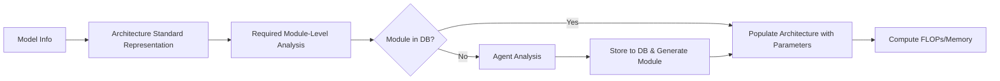

<system_context>
LM-Predictor is a LLM inference performance analysis tool that analyzes PyTorch models' compute and memory requirements against given hardware specifications.
</system_context>

<file_map>
model_analyzer.py - Main entry point for model FLOP/memory analysis
module_analyzer.py - Module analysis with database cache and agent fallback
module_generator_agent.py - Claude Code agent for generating module files
module_db.json - Module computation database with FLOP/memory formulas
model_representation_schema.json - JSON schema for model architecture representation
model_representation_examples.json - Example model architectures following schema
models/ - Standard model architecture JSON representations
generated_modules/ - Auto-generated Python modules (flat structure)
  registry.py - ModuleRegistry with auto-discovery and convenience functions
  base.py - BaseModule abstract class
  torch_*.py - Generated torch module calculators
  transformers_*.py - Generated transformers module calculators
</file_map>

<pipeline>

</pipeline>

<critical_notes>
- **Add `ultrathink` before each proposed planned step when Claude is in plan mode** - Triggers ultrathink for each planned step
- **Use `uv add <package>` to add dependencies** - Consistent package management
- **Use `uv run python script.py` to run Python scripts** - Proper virtual environment
- **NEVER use `any` types** - Type safety is mandatory throughout system
- **Implement according to DESIGN.md** - If design changes, prompt users to update DESIGN.md
</critical_notes>

