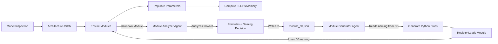

# CLAUDE.md

This file provides guidance to Claude Code (claude.ai/code) when working with code in this repository.

## System Context

LM-Predictor is a LLM inference performance analysis tool that analyzes PyTorch models' compute (FLOPs) and memory requirements. The system uses a database-cached approach with Claude Code agent fallback for analyzing unknown modules.

## Development Commands

**Package Management:**
```bash
uv add <package>              # Add new dependencies
uv run python <script.py>     # Run Python scripts in virtual environment
```

**Analysis Pipeline (4 steps):**
```bash
# Step 1: Generate architecture structure (structure only, no parameters)
uv run python model_analyzer.py --generate-arch --model_id meta-llama/Llama-2-7b-hf

# Step 2: Ensure all needed modules exist (auto-analyze unknown modules)
uv run python model_analyzer.py --ensure-modules --model_id meta-llama/Llama-2-7b-hf

# Step 3: Populate parameters with runtime templates
uv run python model_analyzer.py --populate-arch --model_id meta-llama/Llama-2-7b-hf

# Step 4: Run analysis with specific runtime parameters
uv run python model_analyzer.py --analyze \
  --model_json models/meta-llama-Llama-2-7b-hf_populated.json \
  --batch_size 1 --seq_len 2048 --w_bit 16 --a_bit 16
```

**Standalone Module Analysis:**
```bash
# Analyze a specific module (uses agent if not in database)
uv run python module_analyzer.py <full.class.name>
```

## Architecture Overview

### Two-Step Design Pattern

**Philosophy:** Separate structure from computation parameters.

```
Architecture JSON (structure) → Populated Architecture (structure + parameters) → Analysis (computation)
     ↓                                ↓                                              ↓
  Pure hierarchy              Templates for runtime values             Concrete FLOPs/Memory
  Class names only            {batch_size}, {seq_len}                  Actual numbers
```

### Key Architectural Concepts

**Basic vs Composite Layers:**
- **Basic Layers**: No `sub_layers` field, perform actual computation (Linear, Embedding, SiLU, RMSNorm)
- **Composite Layers**: Have `sub_layers` field, organizational containers (LlamaDecoderLayer, LlamaSdpaAttention)
- **Rule**: Only basic layers have FLOPs/memory calculations

**Template Parameter System:**
- Runtime parameters use string templates: `{batch_size}`, `{seq_len}`, `{w_dtype_bytes}`, `{a_dtype_bytes}`
- Static parameters use concrete values: `hidden_size: 4096`, `num_layers: 32`
- Templates are substituted during analysis step with actual runtime values

**Module Registry Pattern:**
- Full class paths as keys: `torch.nn.modules.linear.Linear`
- **Naming consistency**: Agent decides semantic naming (e.g., `torch_silu.py` / `TorchSilu`) and stores in `module_db.json`
- Registry reads naming from database to ensure 100% consistency
- Single source of truth: modules define their own required parameters via `get_required_parameters()`

### Core Pipeline Flow



## File Structure and Responsibilities

**Entry Points:**
- `model_analyzer.py` - Main CLI for model analysis (4-step pipeline)
- `module_analyzer.py` - Standalone module analysis CLI

**Claude Code Agents:**
- `model_architecture_agent.py` - Generates standardized architecture JSON from model inspection
- `module_analyzer_agent.py` - Analyzes unknown modules' forward() methods for FLOP/memory formulas
- `module_generator_agent.py` - Generates Python calculator classes from JSON formulas
- `populate_parameters_agent.py` - Populates architecture parameters from model config

**Data Files:**
- `module_db.json` - Module computation database (formulas + metadata)
- `models/*.json` - Architecture representations (structure only)
- `models/*_populated.json` - Architecture with parameters (includes templates)

**Generated Code:**
- `generated_modules/base.py` - Abstract base class for calculators
- `generated_modules/registry.py` - Auto-discovery and convenience functions
- `generated_modules/torch_*.py` - Generated PyTorch module calculators
- `generated_modules/transformers_*.py` - Generated Transformers module calculators

**Schemas:**
- `model_representation_schema.json` - Architecture JSON schema
- `module_db_schema.json` - Module database schema
- `*_examples.json` - Example files for reference

## Critical Development Rules

### Type Safety
- **NEVER use `any` types** - Type safety is mandatory throughout the system
- Use explicit type annotations for all function signatures
- Prefer `Dict[str, Any]` over `dict` when values have mixed types

### File Management
- **ALWAYS prefer editing existing files to creating new ones**
- NEVER proactively create documentation files unless explicitly requested
- Follow the flat directory structure in `generated_modules/`

### Design Consistency
- **Implement according to DESIGN.md** - If design changes, prompt users to update DESIGN.md first
- Maintain the two-step architecture/parameters separation
- Preserve the basic/composite layer distinction

### Naming Conventions
- **Database keys**: `library_ClassName` (e.g., `torch_Linear`, `transformers_LlamaMLP`)
- **Generated classes**: `LibraryClassName` - Agent decides using semantic rules (e.g., `TorchLinear`, `TorchSilu`, `TransformersLlamaRmsNorm`)
- **File names**: snake_case - Agent decides (e.g., `torch_linear.py`, `torch_silu.py`, `transformers_llama_rms_norm.py`)
- **Full class paths**: Complete Python import paths (e.g., `torch.nn.modules.linear.Linear`)
- **Naming workflow**:
  1. `module_analyzer_agent.py` decides semantic naming for files/classes
  2. Naming stored in `module_db.json` (`generated_file_name`, `generated_class_name`)
  3. `module_generator_agent.py` reads naming from database
  4. `registry.py` reads naming from database to load modules
  5. **Result**: 100% naming consistency guaranteed

### Module Analysis
- **Cache-first**: Always check `module_db.json` before invoking agents
- **Database updates**: Module analysis results (formulas + naming) cached in `module_db.json`
- **Generation**: New module Python files auto-generated in `generated_modules/` using exact naming from DB
- **Validation**: Use `human_validated: false` initially, update after manual review

### Claude Code Agent Usage
- Use headless mode: `--dangerously-skip-permissions`
- Timeouts: 600s for architecture/analysis agents, 300s for generation/population agents
- Debug output: Return code, stdout, stderr for all subprocess calls
- Error handling: Diagnostics files created only on failure

## Parameter Population Logic

### Priority Order (highest to lowest)
1. **Runtime parameters** - User-provided via CLI flags
2. **Direct config mapping** - Exact key match in model config
3. **Derived calculations** - Computed from config values (e.g., `head_dim = hidden_size / num_heads`)
4. **Enhanced structure extraction** - Parsed from model inspection output
5. **Default values** - Fallback defaults

### Template Variables
Runtime parameters that vary per inference run:
- `{batch_size}` - Batch size (B)
- `{seq_len}` - Sequence length (S)
- `{w_dtype_bytes}` - Weight precision in bytes (1/2/4/8)
- `{a_dtype_bytes}` - Activation precision in bytes (1/2/4/8)

These are populated as string templates during `--populate-arch` and substituted with actual values during `--analyze`.

## Module Database Format

Each module entry contains:
- `full_class_name` - Complete Python import path
- `code_location` - Original source location (file, line numbers)
- `flop_analysis` - FLOP formula with thinking process
- `memory_analysis` - Memory read/write/intermediate formulas
- `validation` - Human validation status
- `generated_file_name` - Actual generated filename (e.g., `torch_silu.py`) - **NEW**
- `generated_class_name` - Actual generated class name (e.g., `TorchSilu`) - **NEW**

Formulas use `{param}` syntax for parameters (e.g., `2 * {N} * {in_features} * {out_features}`).

**Example entry:**
```json
{
  "torch_SiLU": {
    "full_class_name": "torch.nn.modules.activation.SiLU",
    "generated_file_name": "torch_silu.py",
    "generated_class_name": "TorchSilu",
    "flop_analysis": { ... },
    "memory_analysis": { ... },
    "validation": { "human_validated": false }
  }
}
```

## Common Patterns

**Adding Support for New Module:**
1. Run `--ensure-modules` or analyze directly with `module_analyzer.py`
2. `module_analyzer_agent.py` analyzes forward() method:
   - Generates FLOP/memory formulas
   - Decides semantic naming (file_name + class_name)
   - Writes everything to `module_db.json`
3. `module_generator_agent.py` reads naming from DB and generates Python class
4. Registry loads module using exact naming from database
5. **Result**: No naming mismatches possible

**Debugging Analysis Issues:**
1. Check `*_diagnostics.json` files for agent failures
2. Verify module exists in `module_db.json` with naming fields populated
3. Check parameter template substitution in analysis step
4. Validate all required parameters are populated
5. If "Module not found" error: Check that `generated_file_name` and `generated_class_name` exist in DB

**Extending for New Model:**
1. Use `--generate-arch` to create architecture JSON
2. Identify any new module types (basic layers)
3. Run `--ensure-modules` to analyze unknown modules (auto-generates naming)
4. Populate and analyze with runtime parameters

**Complete Analysis Pipeline (Full Workflow):**
```bash
# Step 1: Generate architecture (structure only)
uv run python model_analyzer.py --generate-arch --model_id meta-llama/Llama-2-7b-hf

# Step 2: Ensure modules exist (analyzes unknown modules, generates naming)
uv run python model_analyzer.py --ensure-modules --model_id meta-llama/Llama-2-7b-hf

# Step 3: Populate parameters (adds runtime templates)
uv run python model_analyzer.py --populate-arch --model_id meta-llama/Llama-2-7b-hf

# Step 4: Run analysis (computes FLOPs/memory)
uv run python model_analyzer.py --analyze \
  --model_json models/meta-llama-Llama-2-7b-hf_populated.json \
  --batch_size 1 --seq_len 2048 --w_bit 16 --a_bit 16
```